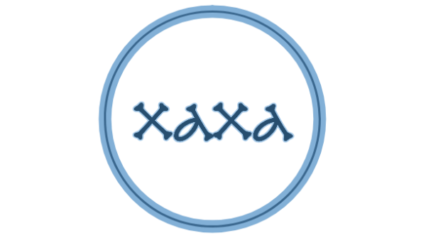

# xaxa [![npm version][npmv-img]][npmv-url] [![github release][ghrelease-img]][ghrelease-url] [![License][license-img]][license-url]

<p align="center">
  <a href="https://github.com/olstenlarck/xaxa">
    
  </a>
</p>
<br>

> :star2:  Zero-config linting, powered by few amazing unicorns  :unicorn:, [AirBnB](https://github.com/airbnb/javascript) :revolving_hearts: & [Prettier](https://prettier.io/) :tada:

[![XAXA code style][codestyle-img]][codestyle-url]
[![CircleCI linux build][linuxbuild-img]][linuxbuild-url] 
[![CodeCov coverage status][codecoverage-img]][codecoverage-url] 
[![DavidDM dependency status][dependencies-img]][dependencies-url] 
[![Renovate App Status][renovateapp-img]][renovateapp-url] 
[![Make A Pull Request][prs-welcome-img]][prs-welcome-url] 

If you have any _how-to_ kind of questions, please read the [Contributing Guide](./CONTRIBUTING.md) and [Code of Conduct](./CODE_OF_CONDUCT.md) documents.  
For bugs reports and feature requests, [please create an issue][open-issue-url] or ping [@tunnckoCore](https://twitter.com/tunnckoCore) at Twitter.

[![Conventional Commits][ccommits-img]][ccommits-url]
[![PayPal Author Support][paypal-donate-img]][paypal-donate-url] 
[![Share Love Tweet][share-love-img]][share-love-url] 
[![NPM Downloads Weekly][downloads-weekly-img]][npmv-url] 
[![NPM Downloads Monthly][downloads-monthly-img]][npmv-url] 
[![NPM Downloads Total][downloads-total-img]][npmv-url] 

Project is [semantically](https://semver.org) & automatically released on [CircleCI][codecoverage-url] with [new-release][] and its [New Release](https://github.com/apps/new-release) Github App.

## Table of Contents
<!-- toc -->

## Install

This project requires [**Node.js**][nodeversion-url] ****. Install it using [**yarn**](https://yarnpkg.com).

```bash
$ yarn add  --dev

# or globally
$ yarn global add 

# and just run it
$ 
```

## API


**[back to top](#thetop)**


## Related Projects
Some of these projects are used here or were inspiration for this one, others are just related. So, thanks for your existance! 


**[back to top](#thetop)**



## Contributing
Please read the [Contributing Guide](./CONTRIBUTING.md) and [Code of Conduct](./CODE_OF_CONDUCT.md) documents for advices.  
For bugs reports and feature requests, [please create an issue][open-issue-url] or ping [@tunnckoCore](https://twitter.com/tunnckoCore) at Twitter.

## License
Copyright (c) -present, [Charlike Mike Reagent][author-link] `<olsten.larck@gmail.com>`.  
Released under the [ License][license-url].

***

  

<!-- Heading badges -->
[npmv-url]: https://www.npmjs.com/package/
[npmv-img]: https://img.shields.io/npm/v/.svg?label=npm%20version

[ghrelease-url]: https://github.com//releases/latest
[ghrelease-img]: https://img.shields.io/github/release/.svg?label=github%20release

[license-url]: https://github.com//blob/master/LICENSE
[license-img]: https://img.shields.io/badge/license-{%= license.replace('-', '%20') %}-blue.svg

<!-- Front line badges -->

[codestyle-url]: https://github.com/olstenlarck/xaxa
[codestyle-img]: https://img.shields.io/badge/code_style-xaxa-brightgreen.svg

[linuxbuild-url]: https://circleci.com/gh//tree/master
[linuxbuild-img]: https://img.shields.io/circleci/project/github//master.svg

[codecoverage-url]: https://codecov.io/gh/
[codecoverage-img]: https://img.shields.io/codecov/c/github//master.svg

[dependencies-url]: https://david-dm.org/
[dependencies-img]: https://img.shields.io/david/.svg

[ccommits-url]: https://conventionalcommits.org/
[ccommits-img]: https://img.shields.io/badge/conventional_commits-1.0.0-yellow.svg

[new-release-url]: https://github.com/tunnckoCore/new-release
[new-release-img]: https://img.shields.io/badge/semantically-released-05C5FF.svg

[downloads-weekly-img]: https://img.shields.io/npm/dw/.svg
[downloads-monthly-img]: https://img.shields.io/npm/dm/.svg
[downloads-total-img]: https://img.shields.io/npm/dt/.svg

[renovateapp-url]: https://renovatebot.com
[renovateapp-img]: https://img.shields.io/badge/renovate-enabled-brightgreen.svg

[prs-welcome-img]: https://img.shields.io/badge/PRs-welcome-brightgreen.svg
[prs-welcome-url]: http://makeapullrequest.com

[paypal-donate-url]: https://paypal.me/tunnckoCore/10
[paypal-donate-img]: https://img.shields.io/badge/$-support-f47721.svg

[share-love-url]: https://twitter.com/intent/tweet?text=https://github.com/&via=tunnckoCore
[share-love-img]: https://img.shields.io/badge/twitter-share-1da1f2.svg
[open-issue-url]: https://github.com//issues/new
[author-link]: https://i.am.charlike.online